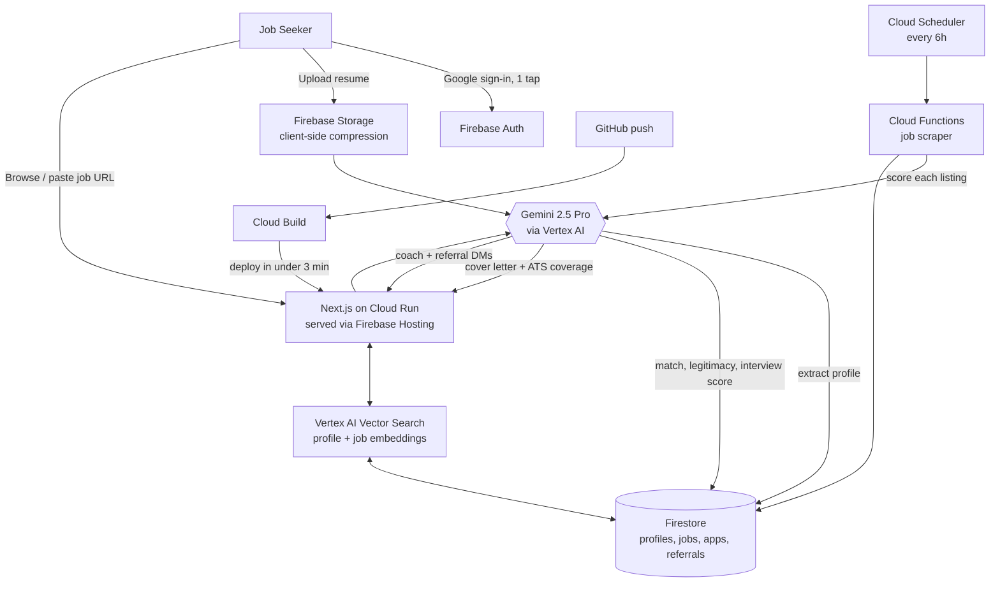

# 🧭 Afro Adventurer: Career Compass
### AI-powered job trust + opportunity intelligence system


---

## 🚀 Overview

**Career Compass helps global talent find legitimate, high-signal job opportunities and avoid wasting time on low-quality or fake listings.**

Instead of endlessly applying into the void, users get:

* ranked opportunities
* legitimacy scoring
* interview likelihood prediction
* AI-generated career insights
* a voice-enabled career coach (emotional + tactical)
* warm referral intros to people already inside target companies

Built with **Google Gemini 2.5 Pro (via Vertex AI)** for the *Best Use of Gemini* hackathon category — where Gemini is the decision engine at every step, not a cosmetic add-on.

---

## ⚠️ Problem

Modern job seekers face three core issues:

* 🔴 Job boards are noisy and unfiltered
* 🔴 Remote jobs are often fake, outdated, or misrepresented
* 🔴 AI hiring systems auto-reject candidates before human review

As a result, skilled candidates waste weeks or months applying blindly with no signal. **Diaspora and Global South talent are hit hardest** — less network visibility, and more exposure to region-specific scams.

---

## 💡 Solution

Career Compass introduces an **AI career intelligence layer** that helps users decide:

> “What should I apply to first — and what should I ignore?”

We turn job search from volume-based to **signal-based decision making**. Every job has to answer three questions before it earns your time:

> **Is this real?** · **Is this worth my time?** · **Do I have a chance?**

---

## 🧠 Core Features (MVP)

### 1. Resume Intelligence

* Upload resume or paste profile
* Gemini extracts (in under 3 seconds, no forms):
  * skills
  * seniority level
  * role intent
  * strengths & gaps
  * origin city + years of experience

---

### 2. Job Scoring Engine (Gemini-Powered)

Each job is evaluated across:

* 🎯 Match Score (fit to resume)
* 🛡️ Legitimacy Score (trust / scam / credibility filter)
* 📈 Interview Likelihood Score
* 🌍 Remote Authenticity Score
* ⚡ Apply Priority Rank

---

### 3. “Why You Might Get Rejected” (Key Innovation)

Gemini explains:

* missing skills
* mismatch signals
* ATS / screening risks
* role misalignment

This turns the system into a **career advisor, not just a job board.**

---

### 4. Ranked Opportunity Feed

Users see:

* Top 3–5 best opportunities only
* Clear scoring breakdown
* Apply / Skip recommendations
* Priority ordering based on success probability

| Badge | Trigger |
| :-- | :-- |
| ⚡ **Apply Now** | High match · Legitimacy ≥ 85 · interview High |
| ◷ **Maybe Later** | Solid match but high competition or medium signal |
| ⊘ **Skip** | Legitimacy < 50 or strong scam / anomaly flags |

---

### 5. Nia — AI Career Coach

A voice-enabled coach powered by Gemini with full access to the user's live profile — not a generic FAQ bot, it knows who you are.

* Pairs **tactical strategy** (what to apply to, how to position) with **mental-health-aware pacing** to fight burnout
* Voice-to-text input for the hard days when typing is too much
* Turns a natural conversation into live search filters (cognitive style, workstyle, location, salary goal, target role)

---

### 6. Warm Referral Network

* Surfaces community members already referring at companies you fit
* Gemini drafts a **personalized intro DM** for each one
* Warm intros convert roughly 3× a cold apply

---

## 🧪 How It Works

```
Resume Upload
      ↓
Gemini Profile Extraction
      ↓
Job Dataset Ingestion
      ↓
Gemini Evaluation Layer
      ↓
Scoring Engine:
   - Match Score
   - Legitimacy Score
   - Interview Likelihood
      ↓
Ranking System
      ↓
Top Opportunity Feed
```

---

## 🏗️ Architecture (Built Entirely on Google Cloud)



| Layer | Google service | Job |
| :-- | :-- | :-- |
| Intelligence | **Gemini 2.5 Pro / Vertex AI** | Every scoring, extraction, writing & coaching decision |
| Matching | **Vertex AI Vector Search** | Embeds profiles + jobs, finds similarity at scale |
| Auth | **Firebase Auth** | One-tap Google sign-in, no passwords |
| Database | **Firestore** | Real-time store: profiles, jobs, applications, referrals |
| Files | **Firebase Storage** | Resumes + photos, compressed for slower mobile networks |
| Jobs pipeline | **Cloud Functions + Cloud Scheduler** | Scrape employer APIs every 6h, vet via Gemini |
| Hosting | **Cloud Run + Firebase Hosting** | Auto-scaling app, global edge caching |
| CI/CD | **Cloud Build** | Push to GitHub → live in under 3 minutes |

---

## 🧰 Tech Stack

* Google Gemini 2.5 Pro via Vertex AI (core intelligence engine)
* Vertex AI Vector Search (matching)
* Firebase Auth · Firestore · Firebase Storage
* Cloud Functions + Cloud Scheduler (job pipeline)
* Next.js on Cloud Run · Firebase Hosting (frontend)
* Cloud Build (CI/CD)
* Python / FastAPI (scoring services)
* JSON / sample job dataset (hackathon mode)

---

## 🔥 What Makes This Different

Most job tools:

* optimize resumes
* auto-apply to jobs
* or match keywords

Career Compass:

> Optimizes **decision-making under uncertainty**

We don’t just tell users what jobs exist.
We tell them:

* which jobs are real
* which jobs are worth their time
* which jobs they are most likely to actually get

---

## 🧭 Key Innovation: Legitimacy Score

A Gemini-powered trust filter that evaluates:

* company credibility signals
* job clarity and structure
* hiring realism
* scam indicators (including African-market red flags: missing company site, unrealistic salary, suspicious apply URL)
* outdated or duplicate postings

High-confidence legitimate listings go live automatically; only edge cases reach a human reviewer. This helps users avoid low-quality or fake opportunities.

---

## 🌍 Vision

We believe the future of work is:

* distributed
* AI-filtered
* referral-driven
* trust-based

Career Compass builds the **signal layer for global opportunity access.**

> *"By the time a job seeker clicks apply, Gemini has already read their resume, scored the job, written their cover letter, found their referrer, and removed every obstacle between them and an opportunity."*

---

## 🏁 Hackathon Goal

Demonstrate how Gemini can be used not just for chat or content generation, but for:

> 🧠 real-world decision intelligence in workforce mobility

---

## 📽️ Demo Flow

1. Upload resume
2. AI extracts profile
3. Jobs are evaluated using Gemini
4. System returns ranked opportunities
5. User sees:
   * match score
   * legitimacy score
   * interview likelihood
   * “why you may get rejected”
6. Nia (voice coach) gets the user through the hard days and drafts a warm referral intro

---

## 🛠️ Status

MVP built for hackathon demo

Future expansion:

* referral graph network
* real job APIs
* diaspora signal matching system
* recruiter integration layer

---

💰 Business Model

Career Compass is designed as a scalable venture-ready workforce intelligence platform.

B2C

Premium subscriptions for:

Advanced opportunity intelligence
Interview coaching
Career planning
Referral assistance
AI-powered application optimization

B2B

Recruiters and employers gain access to:

Pre-qualified talent pipelines
Candidate intelligence
Trust and legitimacy scoring
Referral infrastructure
Workforce mobility analytics

<div align="center">

**Built with ❤️ for global talent · by [Afro Adventurer](https://afroadventurers.com) · Build54 Nairobi 2026**

</div>
